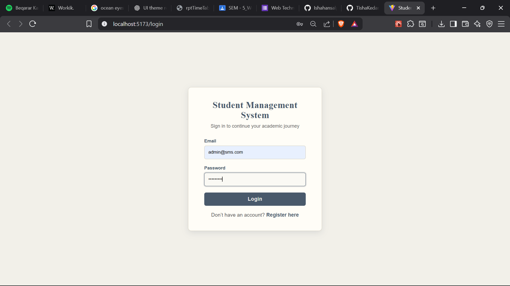
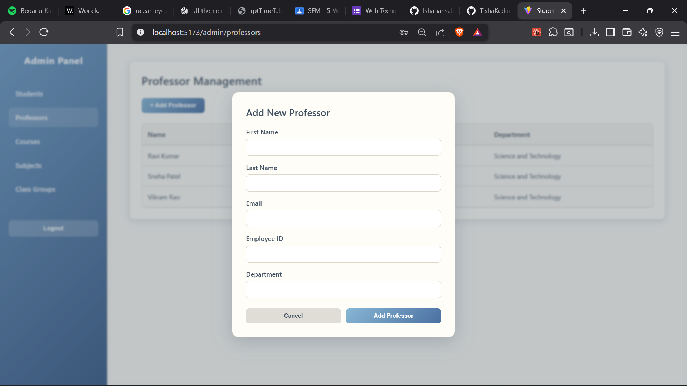
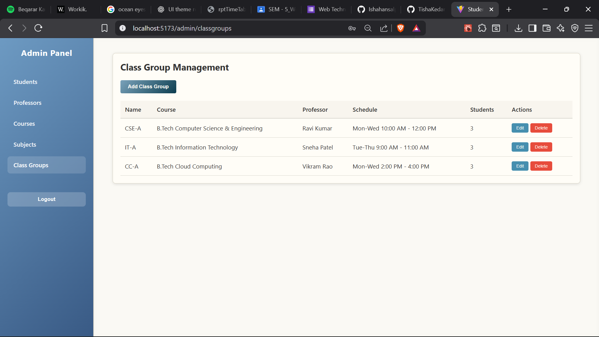
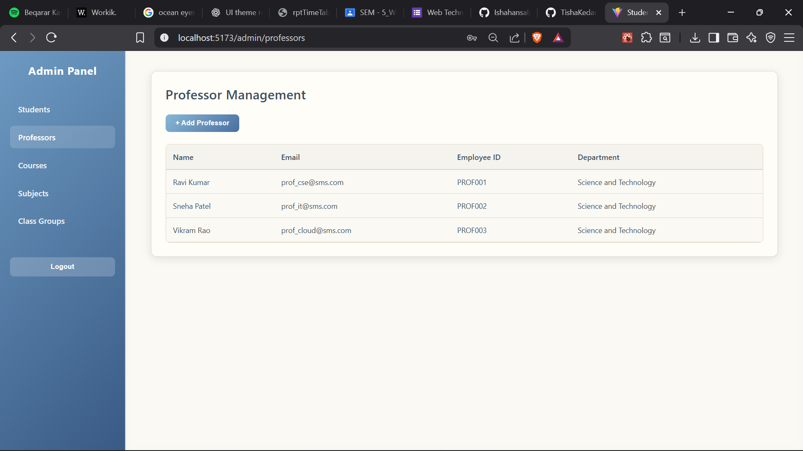
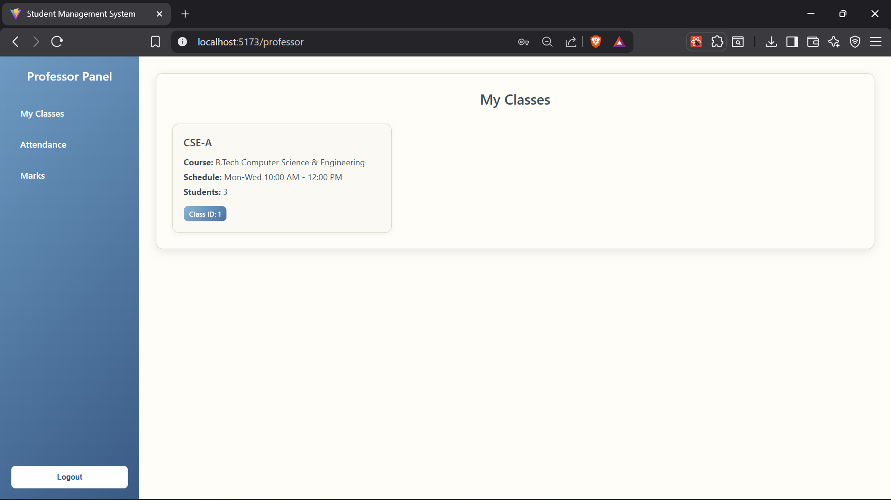
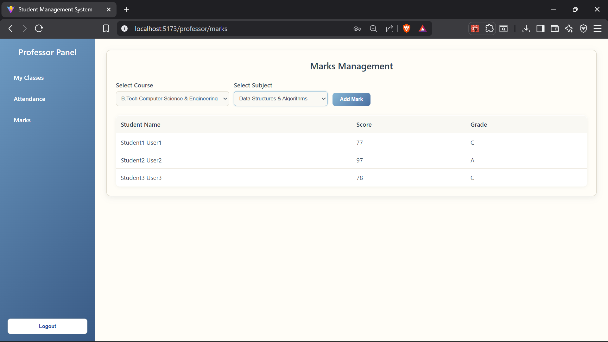
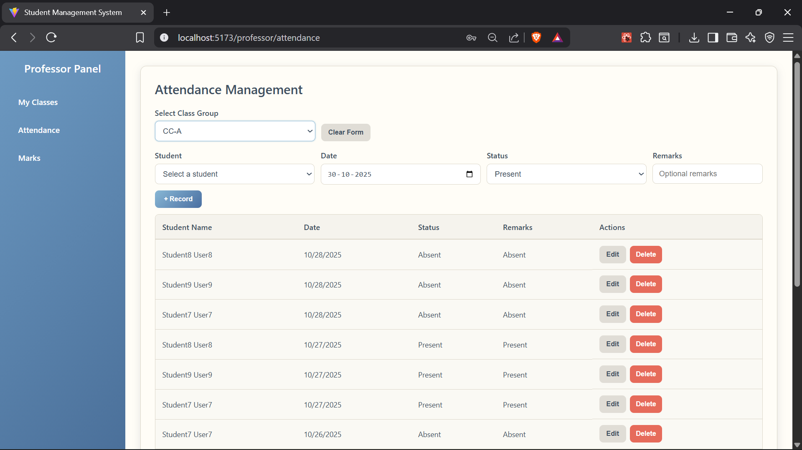
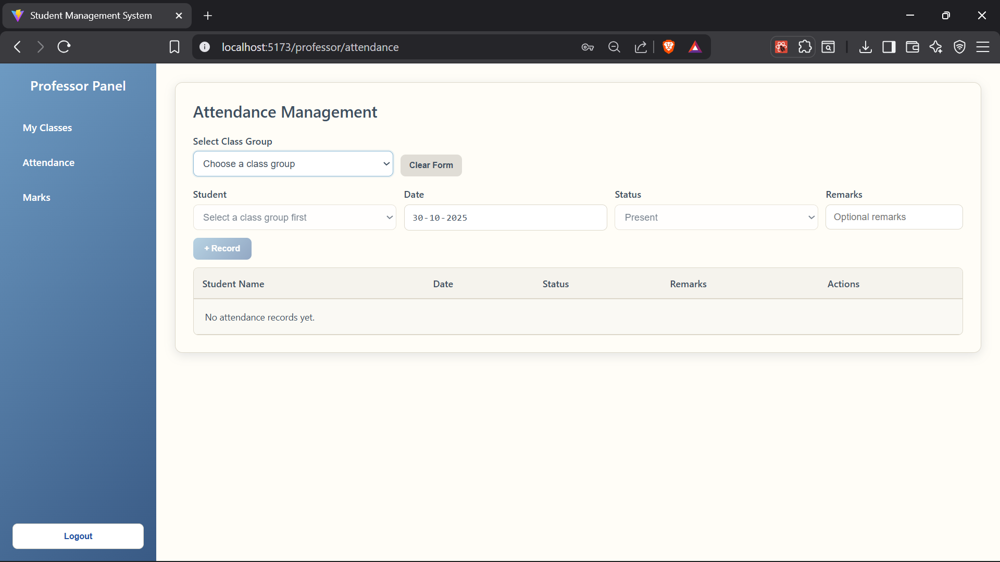
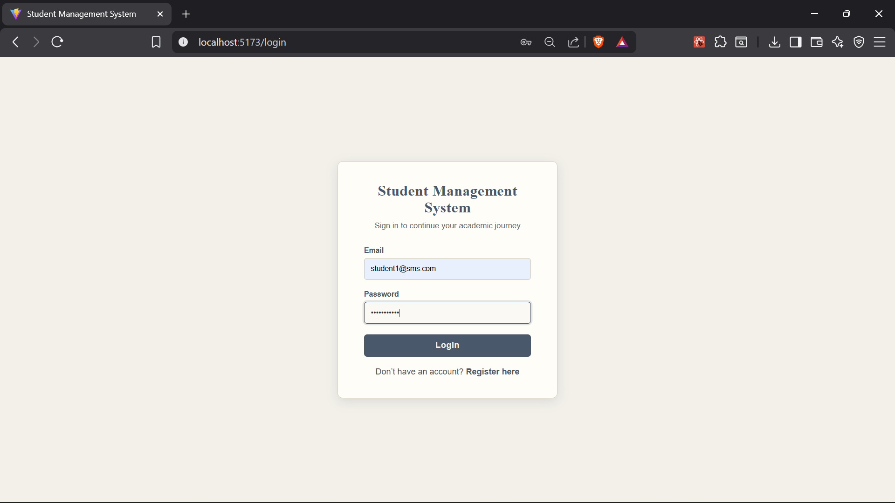
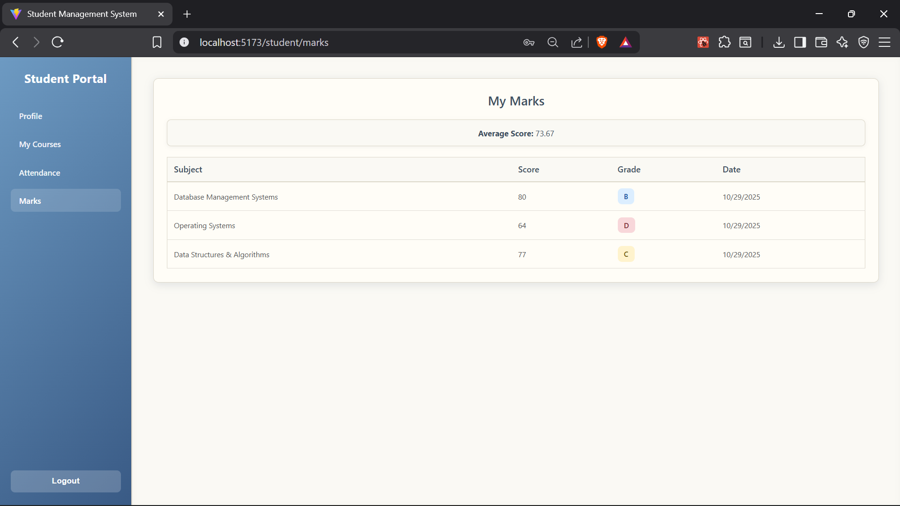

# Student Management System

A full-stack Student Management System built with .NET 8 backend and React/Next.js frontend.

## Features

- **Role-based Authentication**: Admin, Professor, and Student roles
- **Admin Dashboard**: Manage students, professors, courses, subjects, and class groups
- **Professor Dashboard**: View courses, manage attendance, record marks
- **Student Dashboard**: View profile, attendance, marks, and courses
- **JWT Authentication**: Secure API endpoints
- **SQLite Database**: Lightweight database for development

## Tech Stack

### Backend
- .NET 8 Web API
- Entity Framework Core
- SQLite Database
- JWT Authentication
- ASP.NET Core Identity

### Frontend
- React 18 with Vite (Frontend/)
- Next.js 16 (app/)
- React Router v6
- Axios
- Styled Components

## 📸 Screenshots

### 🔐 Admin Panel









### 👨‍🏫 Professor









### 🎓 Student






## Prerequisites

- [.NET 8 SDK](https://dotnet.microsoft.com/download/dotnet/8.0)
- [Node.js](https://nodejs.org/) (v16 or higher)
- [npm](https://www.npmjs.com/) or [yarn](https://yarnpkg.com/)

## Setup Instructions

### 1. Clone the Repository

```bash
git clone <repository-url>
cd studentmanagementsystemnew2-copy
```

### 2. Backend Setup

1. **Navigate to Backend directory**
   ```bash
   cd Backend
   ```

2. **Restore NuGet packages**
   ```bash
   dotnet restore
   ```

3. **Apply database migrations**
   ```bash
   dotnet ef database update
   ```

   If you don't have EF Core tools installed:
   ```bash
   dotnet tool install --global dotnet-ef
   ```

4. **Run the backend**
   ```bash
   dotnet run
   ```

   The API will start at `http://localhost:5000` (Swagger at `http://localhost:5000/swagger`)

### 3. Frontend Setup

#### Option A: React with Vite (Frontend/)

1. **Navigate to Frontend directory**
   ```bash
   cd Frontend
   ```

2. **Install dependencies**
   ```bash
   npm install
   ```

3. **Start the development server**
   ```bash
   npm run dev
   ```

   The frontend will start at `http://localhost:5173`

#### Option B: Next.js (app/)

1. **Navigate to root directory**
   ```bash
   cd ..
   ```

2. **Install dependencies**
   ```bash
   npm install
   ```

3. **Start the development server**
   ```bash
   npm run dev
   ```

   The frontend will start at `http://localhost:3000`

## Default Credentials

The system comes with pre-seeded users for testing:

### Admin
- **Email**: admin@sms.com
- **Password**: Admin@123

### Professors
- **Email**: prof_cse@sms.com
- **Password**: Prof@123
- **Email**: prof_it@sms.com
- **Password**: Prof@123
- **Email**: prof_cloud@sms.com
- **Password**: Prof@123

### Students
- **Email**: student1@sms.com to student9@sms.com
- **Password**: Student@123

## API Endpoints

### Authentication
- `POST /api/auth/login` - User login
- `POST /api/auth/register` - User registration

### Admin Endpoints (Requires Admin Role)
- `GET /api/admin/students` - Get all students
- `POST /api/admin/students` - Create student
- `PUT /api/admin/students/{id}` - Update student
- `DELETE /api/admin/students/{id}` - Delete student
- `GET /api/admin/professors` - Get all professors
- `POST /api/admin/professors` - Create professor
- `GET /api/admin/courses` - Get all courses
- `POST /api/admin/courses` - Create course
- `PUT /api/admin/courses/{id}` - Update course
- `DELETE /api/admin/courses/{id}` - Delete course
- `GET /api/admin/subjects` - Get all subjects
- `POST /api/admin/subjects` - Create subject
- `PUT /api/admin/subjects/{id}` - Update subject
- `DELETE /api/admin/subjects/{id}` - Delete subject
- `GET /api/admin/classgroups` - Get all class groups
- `POST /api/admin/classgroups` - Create class group
- `PUT /api/admin/classgroups/{id}` - Update class group
- `DELETE /api/admin/classgroups/{id}` - Delete class group

### Professor Endpoints (Requires Professor Role)
- `GET /api/professor/profile` - Get professor profile
- `GET /api/professor/courses` - Get professor's courses
- `GET /api/professor/classgroups` - Get professor's class groups
- `GET /api/professor/classgroups/{id}/students` - Get students in class group
- `POST /api/professor/attendance` - Record attendance
- `GET /api/professor/attendance/{classGroupId}` - Get attendance by class group
- `POST /api/professor/marks` - Record marks
- `GET /api/professor/marks/{subjectId}` - Get marks by subject

### Student Endpoints (Requires Student Role)
- `GET /api/student/profile` - Get student profile
- `GET /api/student/attendance` - Get student's attendance
- `GET /api/student/marks` - Get student's marks
- `GET /api/student/courses` - Get student's courses

## Project Structure

```
StudentManagementSystem/
├── Backend/
│   ├── Controllers/         # API Controllers
│   ├── Data/               # DbContext and Seeder
│   ├── DTOs/               # Data Transfer Objects
│   ├── Models/             # Entity Models
│   ├── Services/           # Business Logic Services
│   ├── Migrations/         # EF Core Migrations
│   ├── Program.cs          # Application Entry Point
│   └── appsettings.json    # Configuration
│
├── Frontend/               # React with Vite
│   ├── src/
│   │   ├── components/     # Reusable Components
│   │   ├── pages/          # Page Components
│   │   │   ├── admin/      # Admin Dashboard Pages
│   │   │   ├── professor/  # Professor Dashboard Pages
│   │   └── student/        # Student Dashboard Pages
│   ├── services/           # API Service Layer
│   └── package.json
│
├── app/                    # Next.js App
│   ├── globals.css
│   ├── layout.jsx
│   └── page.jsx
│
├── components/             # Shared UI Components
├── docker-compose.yml      # Docker Setup
├── README.md
└── SETUP_GUIDE.md
```

## Database Schema

The system uses the following main entities:

- **User**: Base user authentication
- **Admin**: Admin-specific data
- **Professor**: Professor-specific data
- **Student**: Student-specific data
- **Course**: Course information
- **Subject**: Subject information
- **ClassGroup**: Class group/section
- **Attendance**: Student attendance records
- **Mark**: Student marks/grades
- **ProfessorSubject**: Many-to-many relationship

## Troubleshooting

### Backend Issues

1. **Port already in use**
   - Change the port in `Backend/Program.cs`

2. **Database migration errors**
   ```bash
   cd Backend
   dotnet ef database drop
   dotnet ef migrations remove
   dotnet ef migrations add InitialCreate
   dotnet ef database update
   ```

3. **CORS errors**
   - Ensure frontend URLs are added in `Backend/Program.cs` CORS policy

### Frontend Issues

1. **API connection errors**
   - Check that backend is running
   - Verify API URL in frontend service files

2. **Module not found errors**
   ```bash
   rm -rf node_modules package-lock.json
   npm install
   ```

3. **Port already in use**
   - Vite will automatically try the next available port
   - Or specify a port in `vite.config.js`

## Development Tips

- The backend automatically seeds the database with sample data on first run
- JWT tokens expire after 24 hours (configurable in `appsettings.json`)
- All passwords are hashed using SHA256
- The frontend stores JWT token in localStorage
- API requests automatically include the JWT token in headers

## Building for Production

### Backend
```bash
cd Backend
dotnet publish -c Release -o ./publish
```

### Frontend
```bash
cd Frontend
npm run build
```

The production build will be in the `Frontend/dist` directory.


## License

This project is for educational purposes.

